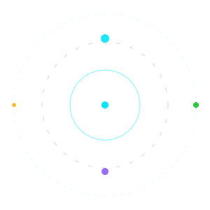
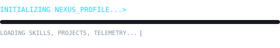

<!-- ═══════════════ ANIMATED HEADER ═══════════════ -->

  

SHUBHAM

// SOFTWARE DEVELOPER • BUILDER • EXPLORER

 

 

  

  

 

<!-- ═══════════════ SYSTEM STATUS ═══════════════ -->

⟩ SYSTEM STATUS

 

  

    ●
    ●
    ●
    &nbsp;&nbsp;
    SYSTEM_INTERFACE v3.2
  

  

    USER&nbsp;&nbsp;&nbsp;&nbsp;&nbsp;&nbsp;&nbsp; : <b style="color:#FFFFFF;">SHUBHAM</b> 
    ROLE&nbsp;&nbsp;&nbsp;&nbsp;&nbsp;&nbsp;&nbsp; : <b style="color:#FFFFFF;">COMPUTER SCIENCE STUDENT</b> 
    STATUS&nbsp;&nbsp;&nbsp;&nbsp; : <b style="color:#27C93F;">● ONLINE</b> 
    MODE&nbsp;&nbsp;&nbsp;&nbsp;&nbsp;&nbsp;&nbsp; : <b style="color:#8B5CF6;">BUILD</b>  
    CURRENT FOCUS 
    ├── WEB DEVELOPMENT 
    ├── SOFTWARE DEVELOPMENT 
    ├── GAME DEVELOPMENT 
    ├── 3D EXPERIENCES 
    └── EXPLORING AI  
    MISSION 
    └── Turn interesting ideas into real products.
  

<!-- ═══════════════ ABOUT ME ═══════════════ -->

⟩ ABOUT ME

 

  

    ABOUT // user.personal_log
  

  I am a Computer Science student who enjoys building things. 
  I like turning ideas from <b style="color:#00E5FF;">concept</b> to <b style="color:#8B5CF6;">reality</b>.  

  

    <b style="color:#8B5CF6;">IDEA</b>
    &nbsp;→&nbsp;
    <b style="color:#8B5CF6;">PROTOTYPE</b>
    &nbsp;→&nbsp;
    <b style="color:#8B5CF6;">BUILD</b>
    &nbsp;→&nbsp;
    <b style="color:#8B5CF6;">TEST</b>
    &nbsp;→&nbsp;
    <b style="color:#8B5CF6;">PRODUCT</b>
  

  Currently exploring: software, web, games, 3D, and AI.  

  <b style="color:#00E5FF;">BUILD</b>
   → 
  <b style="color:#FF5F56;">BREAK</b>
   → 
  <b style="color:#FFBD2E;">LEARN</b>
   → 
  <b style="color:#27C93F;">IMPROVE</b>
   → 
  <b style="color:#8B5CF6;">REPEAT</b>

<!-- ═══════════════ TECH STACK ═══════════════ -->

⟩ TECH STACK

 

  

    01 // LANGUAGES
  

  

    
  

   

  

    02 // WEB &amp; BACKEND
  

  

    
  

   

  

    03 // TOOLS &amp; TECHNOLOGIES
  

  

    
  

 

  

    04 // PROFICIENCY
  

  

    C / C++
    

      

    

  

  

    JavaScript / TS
    

      

    

  

  

    Python
    

      

    

  

  

    React / Node.js
    

      

    

  

  

    Three.js / 3D
    

      

    

  

  

    Git / DevOps
    

      

    

  

<!-- ═══════════════ PROJECTS ═══════════════ -->

⟩ PROJECT DATABASE

 

<!-- PROJECT 1 -->

  

    SYS://PROJECT_01
  

  

    FREE_TOOLS_HUB
  

  

    A collection of useful free tools for students and creators.
  

  

    TYPE&nbsp;&nbsp;&nbsp;&nbsp; : Web Platform 
    STACK&nbsp;&nbsp;&nbsp; : React • Node.js • Firebase 
    STATUS&nbsp; : <b style="color:#00E5FF;">IN DEVELOPMENT</b>
  

<!-- PROJECT 2 -->

  

    SYS://PROJECT_02
  

  

    GAME_DEV_LABS
  

  

    Experimental game projects focused on simple mechanics, addictive gameplay and mobile-first experiences.
  

  

    TYPE&nbsp;&nbsp;&nbsp;&nbsp; : Game 
    FOCUS&nbsp;&nbsp;&nbsp; : Gameplay • UX 
    STATUS&nbsp; : <b style="color:#FFBD2E;">BUILDING</b>
  

<!-- PROJECT 3 -->

  

    SYS://PROJECT_03
  

  

    IMMERSIVE_3D_COMMERCE
  

  

    An experimental immersive 3D experience for a cycle and tyre business, using futuristic interfaces and spatial navigation concepts.
  

  

    TYPE&nbsp;&nbsp;&nbsp;&nbsp; : Web Experience 
    STACK&nbsp;&nbsp;&nbsp; : Three.js • GSAP 
    STATUS&nbsp; : <b style="color:#8B5CF6;">EXPERIMENTAL</b>
  

<!-- PROJECT 4 -->

  

    SYS://PROJECT_04
  

  

    SMART_CAMPUS / CIVIC_TECH
  

  

    A problem-reporting and resolution platform connecting citizens, institutions and authorities through a structured workflow.
  

  

    TYPE&nbsp;&nbsp;&nbsp;&nbsp; : Full-Stack Platform 
    STACK&nbsp;&nbsp;&nbsp; : MERN • PostgreSQL 
    STATUS&nbsp; : <b style="color:#27C93F;">PROTOTYPE</b>
  

<!-- ═══════════════ GITHUB TELEMETRY ═══════════════ -->

⟩ GITHUB TELEMETRY

 

  

  &nbsp;&nbsp;

  

    

  

 

⟩ CONTRIBUTION MATRIX

 

  

<!-- ═══════════════ CURRENTLY BUILDING ═══════════════ -->

⟩ CURRENTLY BUILDING

 

 

  → Building projects 
  → Learning new technologies 
  → Experimenting with UI/UX 
  → Improving development skills 
  → Turning prototypes into products 

  

    PROGRESS: <b style="color:#00E5FF;">80%</b>
  

<!-- ═══════════════ DEVELOPER PROTOCOL ═══════════════ -->

⟩ DEVELOPER PROTOCOL

 

  <table style="border-collapse:separate;border-spacing:8px;">
    <tbody>
      <tr>
        <td style="text-align:center;background-color:#0D1117;border:1px solid #00E5FF33;border-radius:8px;padding:10px 16px;font-size:11px;">
          
01
THINK
        </td>
        <td style="text-align:center;background-color:#0D1117;border:1px solid #00E5FF33;border-radius:8px;padding:10px 16px;font-size:11px;">
          
02
DESIGN
        </td>
        <td style="text-align:center;background-color:#0D1117;border:1px solid #00E5FF33;border-radius:8px;padding:10px 16px;font-size:11px;">
          
03
BUILD
        </td>
        <td style="text-align:center;background-color:#0D1117;border:1px solid #00E5FF33;border-radius:8px;padding:10px 16px;font-size:11px;">
          
04
TEST
        </td>
      </tr>
      <tr>
        <td style="text-align:center;background-color:#0D1117;border:1px solid #00E5FF33;border-radius:8px;padding:10px 16px;font-size:11px;">
          
05
BREAK
        </td>
        <td style="text-align:center;background-color:#0D1117;border:1px solid #00E5FF33;border-radius:8px;padding:10px 16px;font-size:11px;">
          
06
DEBUG
        </td>
        <td style="text-align:center;background-color:#0D1117;border:1px solid #00E5FF33;border-radius:8px;padding:10px 16px;font-size:11px;">
          
07
LEARN
        </td>
        <td style="text-align:center;background-color:#0D1117;border:1px solid #00E5FF33;border-radius:8px;padding:10px 16px;font-size:11px;">
          
08
SHIP
        </td>
      </tr>
    </tbody>
  </table>

   

  

    "The best way to learn development is to build something."
  

<!-- ═══════════════ CONNECT ═══════════════ -->

⟩ CONNECT

 

  
  
  

    

  

    SYSTEM STATUS : <b style="color:#27C93F;">ONLINE</b>
  

  

    ACCESS LEVEL : DEVELOPER
  

<!-- ═══════════════ FOOTER ═══════════════ -->

  

 

  ◈ DESIGNED WITH PRECISION ◈ BUILT WITH PASSION ◈

